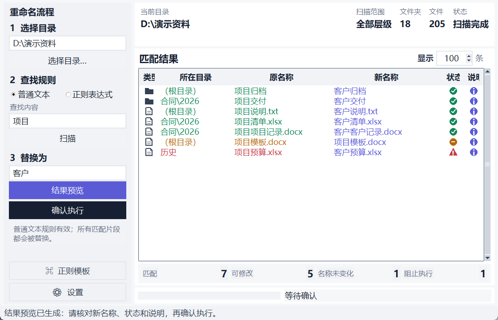
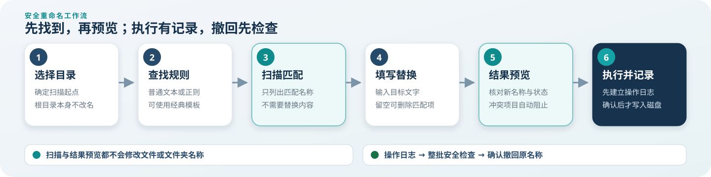
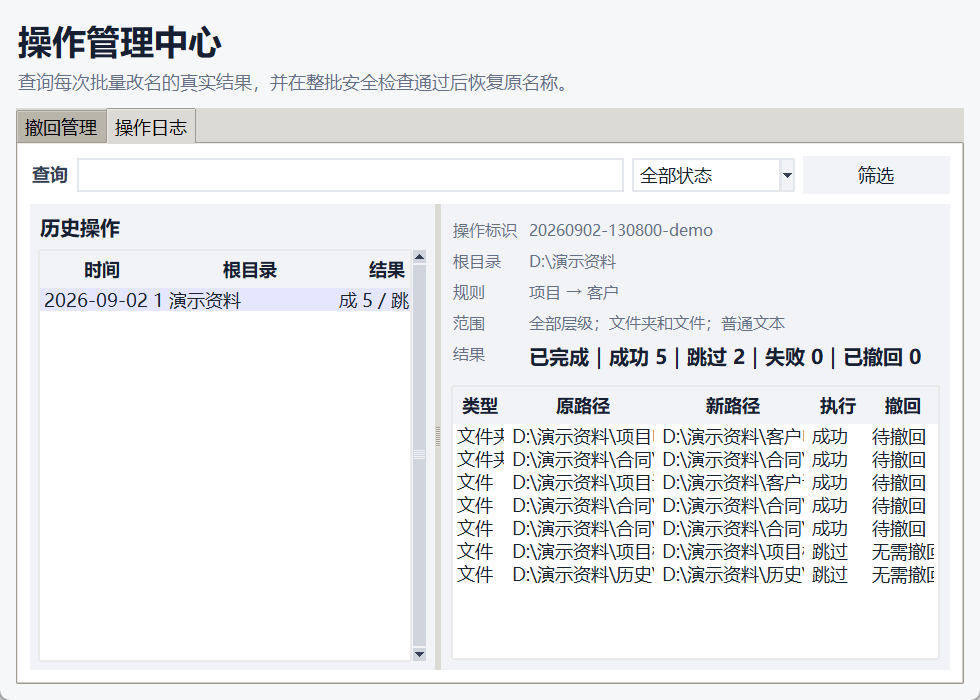
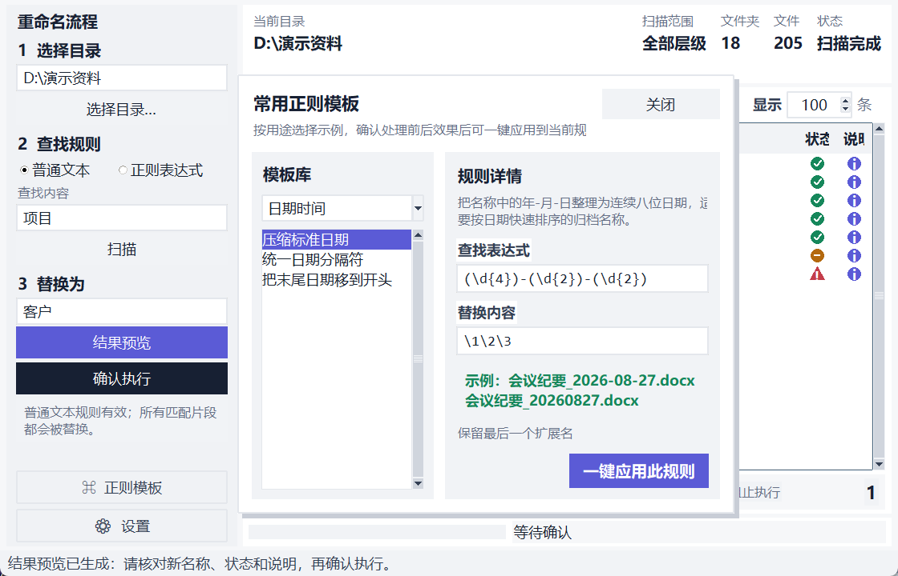
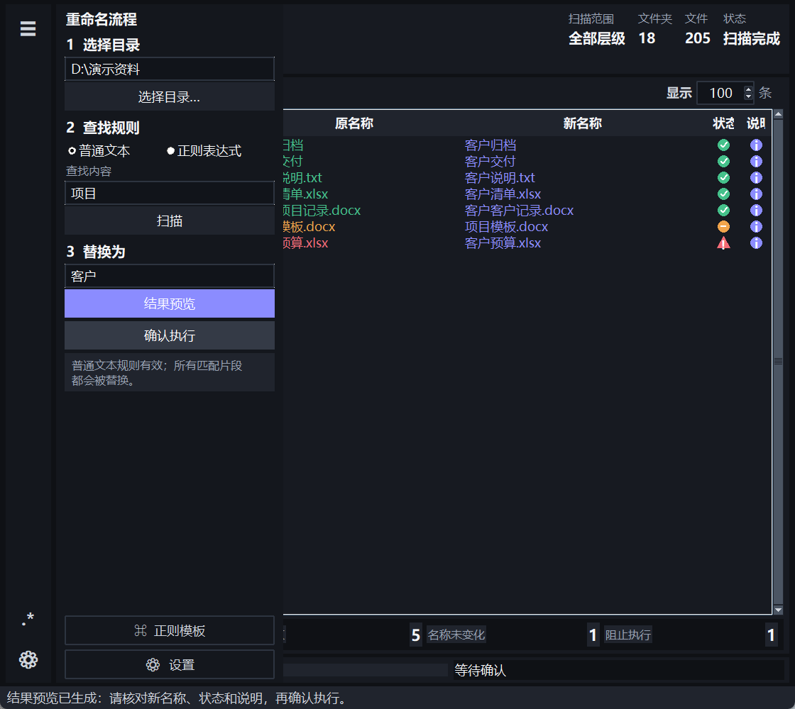

<div align="center">
  
  <h1>批量重命名</h1>
  <p>面向 Windows 多层目录的安全名称整理工具</p>
  <p><strong>当前版本：1.1.0-beta.2</strong></p>
</div>

“批量重命名”用于一次查询并整理当前目录及任意层级子目录中的文件夹和文件名称。程序把扫描、结果预览、执行、操作日志和撤回分成清楚的阶段：先看见真实匹配，再确认新名称与安全状态，最后才修改磁盘。每次执行都会写入本地操作档案，后续可以查询逐项结果，并在整批安全检查通过后恢复原名称。

当前版本处于快速开发期，界面和档案格式仍可能继续演进。它不会覆盖已有项目，也不会把撤回宣传成备份替代品；重要目录仍应先建立独立备份。

## 主工作台



标准与舒展布局把完整流程放在左侧，右侧集中显示目录信息和结果。窗口最小尺寸为 **1120×720**；在常见 1080P、2K 和 4K 标准比例屏幕中会按工作区比例选择舒适大小，超宽屏和竖屏则优先保证内容比例与最小可用尺寸。

结果区上方的“目录概况”在一次遍历后给出当前目录、扫描范围、文件夹总数和文件总数。结果表的“所在目录”只显示根目录之后的相对位置，直属项目显示为“（根目录）”，完整路径仍可通过悬浮说明查看。

表格按照类型和自然名称排序。类型、状态与说明使用紧凑的语义图标；鼠标悬停可查看完整文字，点击状态或说明图标会打开“匹配结果详情”。原名称和新名称列随窗口宽度伸缩，新名称使用主题强调色，便于执行前逐项核对。

匹配统计位于结果表下方，分别显示匹配、可修改、名称未变化和阻止执行。查找内容与替换内容相同的项目仍属于匹配结果，会显示为“名称未变化”，不会被误报成没有找到。

## 六步完成一次重命名



1. **选择目录**：指定扫描起点，根目录本身不会改名。
2. **设置查找规则**：使用普通文本或正则表达式；在查找框按 Enter 也可以开始扫描。
3. **扫描**：只读取名称并列出匹配项目，不计算新名称、不要求填写替换内容，也不修改磁盘。
4. **结果预览**：根据扫描快照计算新名称，检查冲突、非法名称和扩展名保护状态，不重新遍历目录。
5. **确认执行**：再次显示根目录和数量汇总。程序先建立操作档案，然后按安全顺序逐项改名并显示进度。
6. **查看或撤回**：从“功能 → 操作日志”查看真实结果；需要恢复时进入“功能 → 撤回管理”，先做整批安全检查，再确认撤回。

扫描与结果预览有意保持独立。修改目录、层级、处理对象、查找内容或正则模式后，需要重新扫描；只修改替换内容或扩展名保护时，只需重新生成结果预览。预览上限默认 100 条，只限制表格显示数量，不影响匹配统计和最终执行集合。

## 操作日志与撤回管理



每次确认执行前，程序会在当前用户目录创建独立 JSON 操作档案：

```text
%LOCALAPPDATA%\BatchRename\operations
```

日志记录根目录、查找与替换规则、扫描范围、处理对象、执行时间，以及每个文件夹或文件的原路径、新路径、执行结果、说明和撤回状态。项目完成一项就更新一次档案；如果程序异常退出，下一次读取会把未结束记录标记为中断，已经保存的成功项目仍可继续核对。

“操作日志”页面支持按操作标识、根目录、查找内容或替换内容查询，并可按状态筛选。选中一次操作后，右侧显示完整规则、范围、成功/跳过/失败统计和逐项记录。损坏的单个日志会单独标记，不会阻止其他历史记录或主程序启动。

“撤回管理”只处理原操作中真正成功的项目：

- 必须先运行**整批安全检查**；
- 当前名称不存在、项目类型变化或原名称已被占用时，整批撤回不会开始；
- 文件夹和内部项目按原执行顺序的反向恢复，适配嵌套目录同时改名；
- 撤回不会覆盖、删除或合并任何现有文件；
- 运行期间出现占用、权限或并发变化时立即停止，已恢复和待重试项目分别记录；
- 完全撤回的操作不能重复执行。

撤回依赖日志和当前磁盘状态。执行后移动、删除或重新创建相关项目，都可能使安全检查无法通过，这是防止误操作的保护结果。

## 正则模板与扫描设置



不熟悉正则表达式时，可以从左下角打开“正则模板”。面板以约 **40%** 空间展示分类与模板库，以约 **60%** 空间展示规则用途、查找表达式、替换内容、处理前后示例和必要选项。模板覆盖日期时间、编号整理、标签清理、空白规范、片段调整和扩展名等常见场景。

“一键应用此规则”只填写主界面，不会开始扫描或执行。应用后仍应使用真实名称检查匹配结果。

正则模板和设置面板从对应入口附近打开，具有清晰边框与阴影。拖动标题区域可以在主窗口范围内调整位置；再次点击入口、点击关闭、按 Esc 或点击结果工作区会收起面板。两个面板与紧凑工作流抽屉互斥，不会堆叠遮挡。

“设置”包含：

- 全部层级，或最多 1–N 层；
- 同时处理文件夹和文件，或只处理其中一类；
- 是否允许修改文件最后一个扩展名。

默认保护最后一个扩展名。例如普通规则修改“报告.xlsx”时只处理“报告”，不会无意改变文件类型。需要处理扩展名时必须在设置中明确开启。

## 普通文本和正则表达式

普通文本会按原样查找，并替换名称中的每一处匹配内容。替换内容可以为空，表示删除匹配片段。

正则表达式使用 Python 语法，支持捕获组和替换引用。例如：

| 场景 | 查找表达式 | 替换内容 | 示例 |
| --- | --- | --- | --- |
| 压缩日期 | `(\d{4})-(\d{2})-(\d{2})` | `\1\2\3` | `2026-09-02` → `20260902` |
| 移除开头编号 | `^\d+[._ -]*` | 留空 | `01. 项目说明` → `项目说明` |
| 规范连续空白 | `\s+` | 单个空格 | `客户   清单` → `客户 清单` |
| 删除方括号标签 | `\[[^\]]+\]` | 留空 | `[完成]报告` → `报告` |
| 交换两个片段 | `^(.+)-(.+)$` | `\2-\1` | `甲-乙` → `乙-甲` |

表达式语法或捕获组引用无效时，主界面的规则说明会立即提示，扫描或预览不会继续。

## 响应式布局与外观



竖屏或内容比例偏窄时，完整左侧流程会折叠为窄导航栏。顶部图标展开同一套工作流控件，底部 `.*` 与齿轮分别打开正则模板和设置。切换布局不会重建控件，也不会清空目录、规则、匹配快照或预览结果。

“视图 → 外观”提供：

- 跟随系统；
- 浅色；
- 深色。

选择会保存在 `%LOCALAPPDATA%\BatchRename\settings.json`。主题切换会同步更新主工作台、菜单、滚动条、语义图标、悬浮说明、浮动面板和已经打开的操作管理中心，不触发扫描或磁盘操作。

## 安全边界

程序在预览和执行阶段都会检查目标状态：

- 不覆盖已有文件或文件夹；
- 阻止多个项目生成同一目标名称；
- 阻止空名称、Windows 非法字符和 `CON`、`NUL` 等保留名称；
- 执行前再次确认来源仍存在、目标没有被外部创建；
- 子项目先于父文件夹执行，撤回时使用相反顺序；
- 不跟随符号链接进入其他目录；
- 日志无法建立时不开始执行。

### 免测与责任说明

项目包含自动化测试、真实文件系统测试、界面验证和单文件冒烟检查，但无法覆盖所有第三方同步盘、网络磁盘、权限策略、杀毒软件占用和并发修改环境。预览、日志和撤回只能降低风险，不能替代备份。使用者应确认目录权限、核对预览，并对最终确认的磁盘操作负责。

## 安装与运行

### 单文件程序

下载或自行构建 `BatchRename.exe` 后直接运行，不需要单独安装 Python。Windows 可能对尚未签名的预发行程序显示安全提示，请仅使用自己信任的构建产物。

### 从源码运行

需要 Python 3.11 或更高版本：

```powershell
python main.py
```

运行测试：

```powershell
python -m pytest -q
```

生成单文件程序：

```powershell
powershell -NoProfile -ExecutionPolicy Bypass -File .\build.ps1
```

构建脚本会先运行完整测试，再使用 PyInstaller 生成 `dist\BatchRename.exe`。

## 项目结构

```text
batch_rename/
  app.py          主工作台、浮动面板、对话框与操作管理中心
  core.py         扫描、预览、执行、撤回预检与恢复逻辑
  history.py      操作档案模型、原子保存、加载与筛选
  models.py       扫描、执行和撤回数据模型
  examples.py     分类正则模板
  preferences.py  外观设置读取与保存
assets/           应用图标
docs/images/      真实界面预览与流程示意图
docs/plans/       已确认的设计与实施计划
tests/            核心、文件系统、界面、文档和构建测试
tools/            安全生成产品界面预览的工具
CHANGELOG.md      中文开发日志与验证记录
```

设计背景、故障根因、实现取舍和验证证据统一保存在 [开发日志](CHANGELOG.md) 中。

## 联系作者

`lo.c@live.cn`
