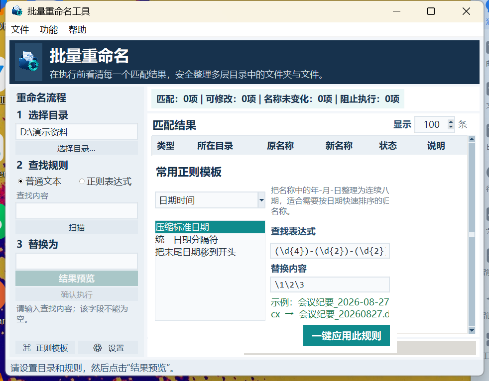

<div align="center">
  
  <h1>批量重命名</h1>
  <p><strong>先找到，再预览，确认无误后一次完成。</strong></p>
  <p>面向 Windows 多层目录的中文批量重命名工具</p>
</div>

“批量重命名”用于快速查询、整理一个目录及其所有子目录中的文件夹和文件名称。它把名称匹配和新名称计算分成两个清楚的阶段，在真正写入磁盘前统一展示原名称、新名称、状态和阻止原因，让大批量操作仍然可以逐项检查。

普通文本适合替换项目名、标签和固定片段；正则表达式适合处理日期、编号、空格、连接符和扩展名。不了解正则也可以从内置模板中查看真实示例并一键应用。

| 项目 | 当前情况 |
| --- | --- |
| 版本 | `1.1.0-beta.1`，快速开发期预发行版 |
| 运行环境 | Windows 10/11；源码需要 Python 3.11 或更高版本 |
| 发布方式 | PyInstaller 无控制台单文件 `BatchRename.exe` |
| 默认窗口 | 960×680，可放大或全屏自适应 |
| 写入原则 | 扫描和结果预览不修改磁盘，只有确认执行后才改名 |
| 下一阶段 | 撤回管理、操作日志正在开发中 |

## 界面预览


左侧按照真实操作顺序放置目录、查找规则、扫描、替换内容、结果预览和确认执行；右侧集中展示匹配统计、统一结果表和处理进度。窗口放大后，新增空间会优先交给结果列表，不会在设置区域留下大片空白。

文件夹和文件位于同一张表中，列顺序为“类型、所在目录、原名称、新名称、状态、说明”。新名称使用青绿色强调，文件夹优先显示，同类项目按名称中的数字自然排序，因此 `文件2` 会排在 `文件10` 前面。

## 六步完成一次安全重命名


### 1. 选择目录

选择需要整理的根目录。根目录本身不会被重命名，只处理它内部的文件夹和文件；符号链接不会被跟随。

### 2. 设置查找规则

选择“普通文本”或“正则表达式”，输入要查找的名称内容。需要限制扫描深度、只处理文件夹或文件时，打开左下角“设置”。

### 3. 扫描匹配

点击“扫描”，或在查找框中按 Enter。扫描只读取目录并列出名称匹配项，不要求先填写替换内容，也不会计算新名称。

### 4. 填写替换内容

在“替换为”中输入目标文字；留空表示删除匹配片段。使用正则时，可以通过 `\1` 或 `\g<名称>` 引用捕获组。

### 5. 生成结果预览

点击“结果预览”，或在替换框中按 Enter。程序使用刚才的匹配快照计算新名称、名称未变化、目标冲突和非法名称，不会重新遍历目录。

### 6. 确认执行

只有预览中存在“可修改”项目时，“确认执行”才会启用。程序会再次展示汇总并要求二次确认；执行期间逐项显示进度，完成记录可从“功能 → 结果详情”查看。

## 扫描、预览与执行有什么区别

| 阶段 | 会做什么 | 不会做什么 | 什么时候需要重新运行 |
| --- | --- | --- | --- |
| 扫描 | 遍历所选范围，记录名称匹配的文件夹和文件 | 不需要替换内容；不计算目标名称；不修改磁盘 | 目录、层级、对象类型、查找内容或正则模式改变后 |
| 结果预览 | 根据匹配快照计算新名称和安全状态 | 不重新读取目录；不修改磁盘 | 替换内容或扩展名设置改变后 |
| 确认执行 | 再次检查来源和目标，只处理“可修改”项目 | 不覆盖已有名称；不执行被阻止或名称未变化项目 | 预览核对无误并通过二次确认后 |

这个划分也让软件可以单独作为名称查询工具使用。即使替换内容与查找内容相同，符合条件的项目仍会显示，并标记为“名称未变化”，不会被误报成匹配 0 项。

## 不懂正则也能直接使用



点击左下角“正则模板”会在主窗口内打开浮动卡片。模板按日期时间、编号整理、标签清理、文本清理、片段调整和扩展名分类；每条规则都展示用途、查找表达式、替换内容及处理前后效果。

“一键应用此规则”只会填写主界面的规则和必要选项，不会开始扫描，更不会修改任何名称。模板与“设置”面板互斥显示；再次点击当前入口、按 Esc，或点击结果表和进度区域即可收起。

### 常用正则示例

| 用途 | 查找表达式 | 替换内容 | 示例结果 |
| --- | --- | --- | --- |
| 压缩日期 | `(\d{4})-(\d{2})-(\d{2})` | `\1\2\3` | `2026-08-27` → `20260827` |
| 统一日期分隔符 | `(\d{4})[._/](\d{2})[._/](\d{2})` | `\1-\2-\3` | `2026.08.27` → `2026-08-27` |
| 保留图片序号 | `IMG_(\d+)` | `照片_\1` | `IMG_001.jpg` → `照片_001.jpg` |
| 删除方括号标签 | `\[[^\]]+\]` | 留空 | `[已审核]合同.docx` → `合同.docx` |
| 合并连续空格 | `\s{2,}` | 单个空格 | `项目  最终  版本` → `项目 最终 版本` |
| 删除副本后缀 | `[_-](副本\|copy)$` | 留空 | `预算_副本.xlsx` → `预算.xlsx` |
| 交换名称片段 | `(.+)_([A-Z]+)` | `\2_\1` | `project_FINAL.txt` → `FINAL_project.txt` |
| 统一 JPEG 扩展名 | `(?i)\.jpe?g$` | `.jpg` | `照片.JPEG` → `照片.jpg` |

涉及扩展名的模板会开启“允许修改扩展名”，其他模板继续保护最后一个文件扩展名。应用后仍应结合自己的真实名称检查表达式和预览结果。

## 适合处理的场景

- 把名称中的“旧版”统一替换为“新版”。
- 删除 `[已审核]`、`[归档]` 等批量标签。
- 整理 `IMG_001`、`IMG_002` 等相机序号名称。
- 将 `2026-09-01` 改为 `20260901` 或统一日期分隔符。
- 清理连续空格、混用连接符、固定前缀和副本后缀。
- 交换项目名和状态片段，例如 `project_FINAL` → `FINAL_project`。
- 将 JPEG、JPG 等扩展名整理为统一写法。
- 不修改磁盘，只查询多层目录里有哪些名称符合条件。

## 匹配结果与统计

结果列表和顶部统计使用四种明确口径：

- **匹配**：名称符合查找条件的全部项目。
- **可修改**：目标名称有效、没有冲突，确认后可以执行的项目。
- **名称未变化**：名称匹配，但替换结果与原名称相同；仍属于匹配结果。
- **阻止执行**：目标已存在、目标重复、名称非法或执行条件不安全的项目。

预览上限默认 100 条，只限制表格显示数量，不改变完整统计和最终执行范围。长名称、路径或说明被列宽缩短时，把鼠标停在相应单元格即可查看完整内容；横向滚动条仅在内容确实无法容纳时出现。

## 扫描范围与设置

左下角“设置”包含影响扫描和预览的选项：

- 默认扫描到最深子目录，也可以限制为 1–N 层。
- 第 1 层是根目录中的直接子项，第 2 层是直接子文件夹中的项目。
- 可以只处理文件夹、只处理文件，或同时处理两者。
- 默认保护最后一个文件扩展名。
- 勾选“允许修改扩展名”后，规则才会处理完整文件名。

层级或处理对象改变后需要重新扫描；扩展名设置改变只会使结果预览失效，不必重新读取目录。

## 安全策略

- 所选根目录本身不会被改名。
- 符号链接不会被跟随，避免扫描越出所选范围。
- 目标名称已经存在时不覆盖，并标明冲突原因。
- 多个来源生成同一目标名称时，相关项目全部停止执行。
- Windows 非法字符、保留设备名、空名称和尾随空格或句点会提前拦截。
- 执行前再次检查来源和目标，处理扫描后发生的文件系统变化。
- 深层项目先处理，父文件夹最后改名，避免路径提前失效。
- 执行前展示分类汇总并二次确认，执行中显示当前项目和总体进度。

当前预发行版尚未提供自动撤回。重要目录请先备份，并认真检查新名称、状态和最终确认信息。

## 菜单与窗口

顶部菜单只放置全局功能，不重复左侧工作流：

- **文件**：退出程序。
- **功能**：执行后的结果详情；撤回管理和操作日志当前为开发中占位。
- **帮助**：使用说明和关于信息；F1 可打开使用说明。

使用说明、关于和结果详情均为单实例窗口。它们会定位在主窗口所在显示器的可用区域并主动获得焦点，避免多屏环境下弹窗分散。

“关于”页面介绍当前能力、开发路线、版本、安全说明和作者联系方式：`lo.c@live.cn`。

## 当前能力与开发路线

### 已经实现

- 普通文本和 Python 正则表达式规则。
- 六类十五条常用正则模板与一键应用。
- 全部层级或 1–N 层扫描，文件夹和文件可独立选择。
- 扫描匹配与结果预览分离，不重复读取目录。
- 文件夹与文件统一列表、自然排序和新名称强调。
- 名称未变化、目标冲突、重复目标和非法名称解释。
- 二次确认、逐项进度、结果详情和多屏窗口管理。
- 960×680 完整布局、高 DPI 与全屏自适应。
- 带应用图标的 PyInstaller 单文件程序。

### 正在开发

- 撤回管理。
- 操作日志。

软件处于快速开发期，预发行版本可能继续调整界面和数据格式。README 仅把已经可用的能力列为已实现功能。

## 开始使用

### 使用单文件程序

从项目构建或发布内容中取得 `BatchRename.exe`，双击即可运行，不需要安装 Python。首次使用建议先选择一个可备份的小目录完成扫描和结果预览，熟悉状态含义后再处理重要资料。

### 从源码运行

需要 Python 3.11 或更高版本：

```powershell
python main.py
```

运行程序只使用 Python 标准库；开发、测试和构建依赖记录在 `requirements-dev.txt`。

## 测试与构建

安装开发依赖：

```powershell
python -m pip install -r requirements-dev.txt
```

运行完整测试：

```powershell
python -m pytest -q
```

构建带应用图标的单文件 EXE：

```powershell
powershell -NoProfile -ExecutionPolicy Bypass -File .\build.ps1
```

构建脚本会先运行完整测试；只有测试通过后才会生成 `dist\BatchRename.exe`。

## 项目结构

```text
batch_rename/
  app.py          图形界面、两阶段状态、后台任务与窗口管理
  core.py         规则、名称匹配、预览计算、冲突检查与安全执行
  examples.py     分类整理且可一键应用的正则模板
  models.py       匹配快照、预览候选与执行结果模型
assets/           应用图标 PNG 与 Windows ICO
docs/images/      主界面、模板面板和操作流程视觉资产
docs/plans/       已确认的设计与实施计划
tests/            核心、界面、文档、示例和构建配置测试
CHANGELOG.md      中文开发日志与验证记录
```

项目的设计背景、问题根因、验证过程和构建校验记录统一保存在 [开发日志](CHANGELOG.md) 中。
